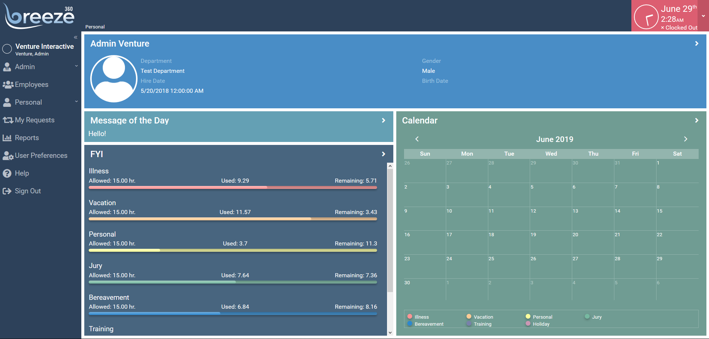

# Breeze

## Environments

### Development

Changes for development mode:
    
- In `app/helper/Baser.js`:
    - API Mode:
        - Comment out line defining `api` as `Api` (disable real API)
        - Uncomment line defining `api` as `DummyApi` (enable local dummy API)
    - Testing Mode:
        - Set `devTestMode` to true to skip login (only works when using dummy api)

- breeze_dummy_api provides dummy apis for development.

#### Running

- Run ``sencha app watch``



### Production

Changes needed before each build / deploy:

- In `app/helper/Baser.js`:
    - API Mode:
        - Uncomment line defining `api` as `Api` (enable real API)
        - Comment out line defining `api` as `DummyApi` (disable local dummy API)
    - Testing Mode:
        - Set `devTestMode` to false to enable login (Not required-- as long as real API is in use, test mode will be disabled)

#### Build

- Run ``sencha app clean && sencha app build``
- Output is in `/build/production/Breeze` directory
- There is a set of bash scripts (`app-build` and `app-build-cfg`) that work togther to help add some additional automation to the build process. Both need to be given executable permission (e.g. `chmod a+x`). In non-bash environments, the `app-build-cfg` script can still be used by running it with Ruby 2.5.0+
    - `app-build`
        - Performs clean operation and then performs production build for both day and night time theme targets
        - Running with switch `-zip` (e.g. `./app-build -zip`) will cause production build output folder `/build/production/Breeze` to be compressed into `/build/production/breeze.zip` for convenience
        - Automatically makes use of `app-build-cfg` to switch API helper class code to use live data api helper script then reverts back to dummy api after build completes
    - `app-build-cfg`
        - Automatically toggles between having the app use the Dummy API helper script and the live API script. Stores current state in `build_mode.dat`, and relies on a comment being available in `app/helper/Base.js`
        - Command line switch `--BUILD` forces mode to be changed to Live API
        - Command line switch `--DEV` forces mode to be changed to Dummy API
        - If no switch is given, mode is changed to whichever mode is not indicated by the `build_mode.dat` file; if no `build_mode.dat` file exists, nothing happens

## Notes

- Using ExtJS 6.5.3 because 6.6.x seems currently incompatible with Themer
- Custom theme `breeze-material` created with themer based on Material theme
- Repo has `/ext` ignored; will need to use `sencha workspace install` to install framework, or copy contents of Ext 6.5.3 to project
    - Expects premium addons for 6.5.3 to be in `/ext/packages`


## Additional Code

### Libraries

Collection of scripts located in `/lib`, most of which are included in the build via sencha's cmd build tool. Some are only for reference, or external libraries copied intact on deploy build.

#### Breeze Time (breeze_time.js)

Globally accessible script (via `BreezeTime` object) that handles conversion between time strings/values and decimal time equivalents. Base constructor accepts hour, minute and period ('AM'/'PM')

Can also be constructed from an integer minute count or from a time string (e.g. `12:01 AM`) using `BreezeTime.resolve`. See documentation comments in `/lib/breeze_time.js` for full details.

#### Dynamic Theme (dynamic_theme.js)

Not actually included in build, and is instead inline in `index.html` in minified form. (Copy of minified version can be found in `/lib/dynamic_theme.min.js`)

Provides logic for checking for presence of a cookie indicating whether to use the regular or night theme, and intercepts Sencha Ext's microloader to tell it wich resource directory to load from

#### Extensions (extensions.js)

Original collection of helper functions extending existing JavaScript objects like `Array`, `Object` and `String`. See in-file doc comments for full details.

#### HTML2Canvas (html2canvas.min.js)

Third party library for creating printable images from page screens via Canvas. Not compiled into `app.js` but is copied intact to deploy `lib` folder.

License blurb from script:
```
    html2canvas 1.0.0-alpha.11 <https://html2canvas.hertzen.com>
    Copyright (c) 2018 Niklas von Hertzen <https://hertzen.com>
    Released under MIT License
```

#### md5.js

Provides globaly accessible `send` method which gives back md5 hash for a given string. Used in login proceedure. (Code is minified using `eval` expression. Original code wasn't included in old code base, but might be worth re-minimizing without using eval). Included in `app.js` on build.

#### Moment.js

Both `moment.min.js` and `moment-with-locales.min.js` are included, copied on build rather than being embedded in `app.js`. These libraries provide various time-related functions, and were used by the old code base. 

While both scripts are copied to the output folder by the build config, neither is current loaded or used by Breeze. (kept as reminder that they are available if need arises)

#### Timely.js

Original set of extension to JavaScript's `Date` object, adding `toUTC` and function which gives extra options for converting to UTC strings, and `shortDate` which outputs a MM/DD/YYYY format version of a date being called on, with option to specify separator character. 

Intended as compliment for `app/helper/Time.js` script methods that modify `Date` prototype. `app/helper/Time.js` includes functions both new and ported for old `homemade.js` script related to time/date that do not modify global objects.

### Overrides

Collection of scripts in `/overrides` that 'override' default sencha scripts/components, adding additional functionality or changing existing functions. They are globally used as stand-ins for the components they override

#### Editor.js

| File         | Namespace                 | Overrides    |
|--------------|---------------------------|--------------|
| `/Editor.js` | `Breeze.overrides.Editor` | `Ext.Editor` |

Fixes a bug encountered when hooking `editcomplete` event on Grid cell with an editor containing a container field.

#### Msg.js

| File      | Namespace              | Overrides        |
|-----------|------------------------|------------------|
| `/Msg.js` | `Breeze.overrides.Msg` | `Ext.MessageBox` |

Adds `themedConfirm` function that duplicates `confirm` but takes an extra arg indicating a `ui` type to set. (Default is `light-themed-dialog`)

#### /mixin/Mashup.js

| File               | Namespace                       | Overrides          |
|--------------------|---------------------------------|--------------------|
| `/mixin/Mashup.js` | `Breeze.overrides.mixin.Mashup` | `Ext.mixin.Mashup` |

Fix for mixin class used with Google Maps API, providing authentication token

#### /field/Container.js


| File                  | Namespace                          | Overrides             |
|-----------------------|------------------------------------|-----------------------|
| `/field/Container.js` | `Breeze.overrides.field.Container` | `Ext.field.Container` |

Adds extra helper function `getComponentInItems` to container fields, mimicking `getComponent` for items inside a container's `items` attribute

#### /grid/plugin/CellEditing.js

| File                          | Namespace                                  | Overrides                     |
|-------------------------------|--------------------------------------------|-------------------------------|
| `/grid/plugin/CellEditing.js` | `Breeze.overrides.grid.plugin.CellEditing` | `Ext.grid.plugin.CellEditing` |

Overrides `CellEditing` plugin for grid making it possible to listen for `beforeedit`, `edit`, and `beforecompleteedit` events.

Based off code found at http://www.coding-ideas.de/2018/06/06/adding-events-to-cellediting-plugin-in-modern-toolkit/

#### Toast.js


| File        | Namespace                | Overrides   |
|-------------|--------------------------|-------------|
| `/Toast.js` | `Breeze.overrides.Toast` | `Ext.Toast` |

Extends built in Toast component so it can accept additional parameters

- `type` indicates a type that changes the background color and displayed indicator icon
- `list` Optional array of items to display below side regular text as a bulleted list

Also extends timeout attribute so it can accept preset names, (`warn`, `info`, `error`) or a two item array of values to add (e.g. `[warn, 5]` would mean the warning preset duration plus 5 seconds)

See in-file doc comments for full details.

### Mixins

TODO

### Plugins

TODO

## Readme

This folder is primarily a container for the top-level pieces of the application.
While you can remove some files and folders that this application does not use,
be sure to read below before deciding what can be deleted and what needs to be
kept in source control.

The following files are all needed to build and load the application.

 - `"app.json"` - The application descriptor which controls how the application is
   built and loaded.
 - `"app.js"` - The file that launches the application. This is primarily used to
   launch an instance of the `MyApp.Application` class.
 - `"index.html"` - The default web page for this application. This can be customized
   in `"app.json"`.
 - `"build.xml"` - The entry point for Sencha Cmd to access the generated build
   script. This file is a place where you can hook into these processes and tune
   them. See the comments in that file for more information.

These files can be ignored from source control as they are regenerated by the build
process.

 - `"build"` - This folder contain the output of the build. The generated CSS file,
   consolidated resources and concatenated JavaScript file are all stored in this
   folder.
 - `"bootstrap.*"` - These files are generated by the build and watch commands to
   enable the application to load in "development mode".

## Basic Application Structure

Applications that target a single toolkit will have the following structure.

    app/                # Contains JavaScript and Theme code
        model/          # Data model classes
        view/           # Views as well as ViewModels and ViewControllers
        store/          # Data stores
        controller/     # Global / application-level controllers

    overrides/          # JavaScript code that is automatically required

    resources/          # Assets such as images, fonts, etc.

### app/

This folder contains JavaScript (.js files) and styling (.scss files) common
for all builds of the application.

#### app/controller/

This folder contains the application's global controllers. ViewControllers are located
alongside their respective view class in `"./view"`. These controllers are used for routing
and other activities that span all views.

#### app/model/

This folder contains the application's (data) Model classes.

#### app/view/

This folder contains the views as well as ViewModels and ViewControllers depending on the
application's architecture. Pure MVC applications may not have ViewModels, for example. For
MVCVM applications or MVC applications that use ViewControllers, the following directory
structure is recommended:

    app/view/
        foo/                    # Some meaningful grouping of one or more views
            Foo.js              # The view class
            Foo.scss            # The view class styling
            FooController.js    # The controller for Foo (a ViewController)
            FooModel.js         # The ViewModel for Foo

This structure helps keep these closely related classes together and easily identifiable in
most tabbed IDE's or text editors.

#### app/store/

This folder contains any number of store instances or types that can then be reused in the
application.

## Overrides

The contents of "overrides" folders are automatically required and included in
builds. These should not be explicitly mentioned in "requires" or "uses" in code.
This area is intended for overrides like these:

    Ext.define('Breeze.overrides.foo.Bar', {
        override: 'Ext.foo.Bar',
        ...
    });

Such overrides, while automatically required, will only be included if their target
class ("Ext.foo.Bar" in this case) is also required. This simplifies applying
patches or extensions to other classes.

